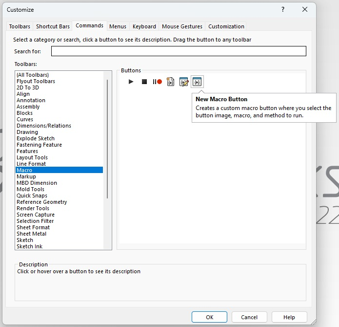
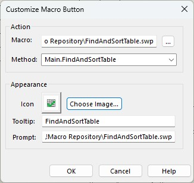
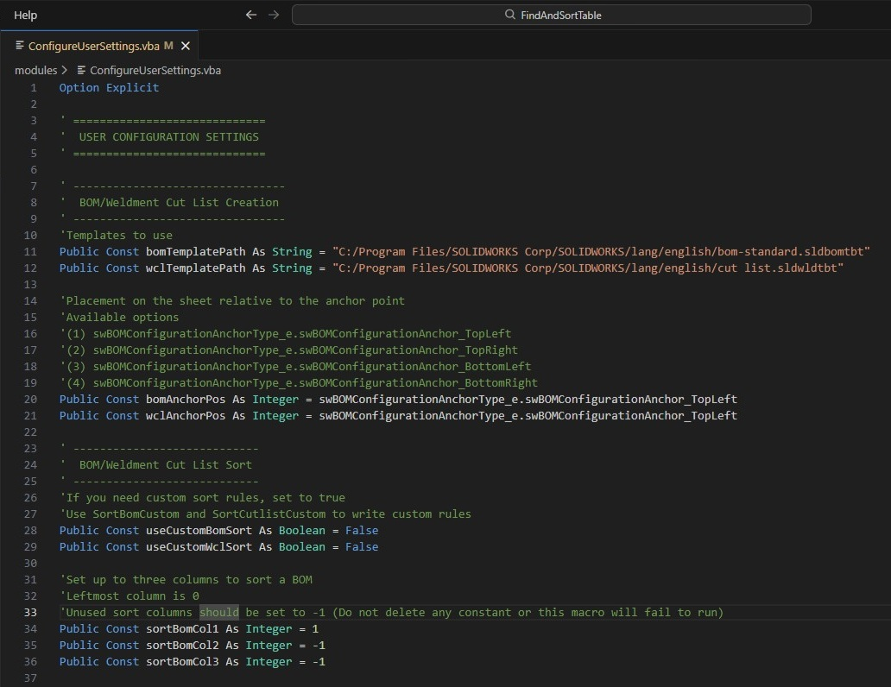
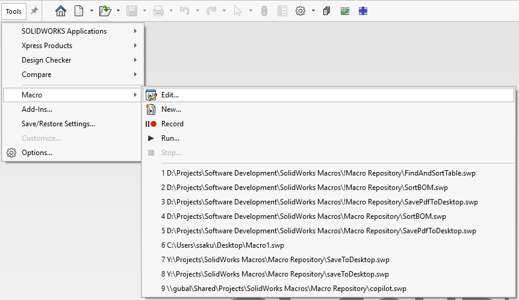
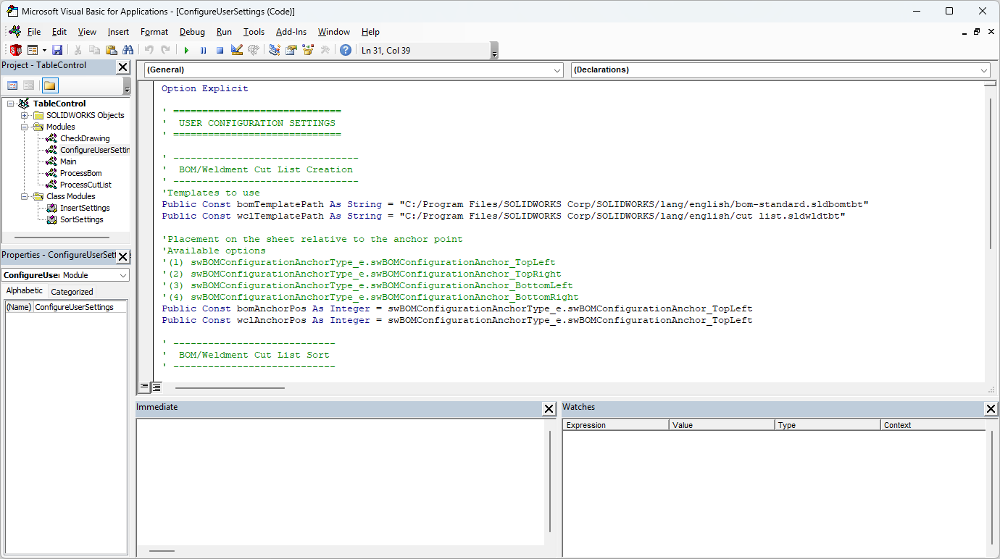

This SolidWorks macro provides a number of improvements to your drafting workflow.
1. It skips the Insert BOM/Weldment Cut List window by applying default settings that the user can configure within the macro editor.
2. It applies a sort to the table at the same time.
3. Sorting a table cannot be assigned to a keyboard shortcut. However, this macro can, saving you navigation time.

# Adding the Macro to SolidWorks
To add to a hotbar, navigate to Tools → Customize...

\
Navigate to Commands → Macro and drag New Macro Button to a toolbar.

\
Attach FindAndSortTable macro to button and add optional icon.

Note that the drawing must be saved in order to export a PDF.

# Configuring the Macro

Most of what you will need is under the module ConfigureUserSettings. If you enable the custom sort options, you will need to write your own code. SortBomCustom() comes with sample code to give some ideas about how to approach applying custom sort criteria.

To edit the code in the .swp file, navigate to Tools → Macro → Edit...

This will bring up the Visual Basic Editor.

# License
FindAndSortTable is available for use under the [MIT License](https://github.com/ssakuda/FindAndSortTable?tab=MIT-1-ov-file). If you need help with modifying this macro, feel free to reach out at ssakuda+github@outlook.com.